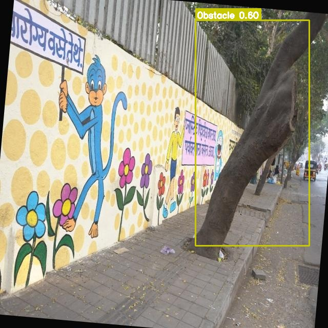
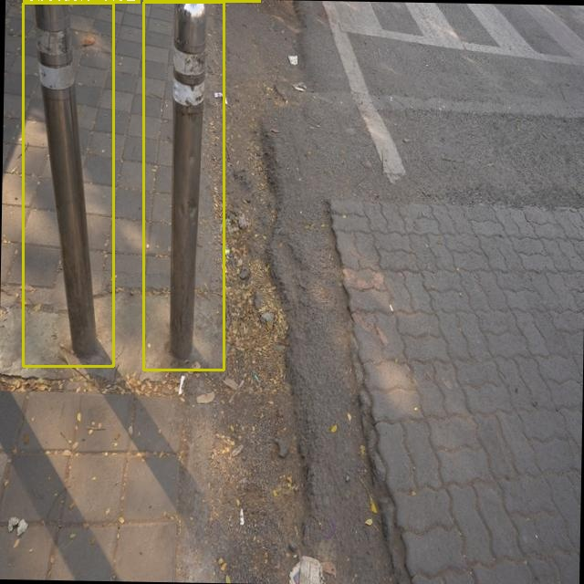

# 🚧 Automated Urban Accessibility Mapping

## 📌 Overview
Urban navigation systems often ignore sidewalk-level accessibility, making it difficult for people with disabilities to navigate safely. This project uses computer vision to detect accessibility barriers such as potholes, broken pavements, and obstacles from street-level images.

> This project is based on a collaborative repository. My contributions include model training, evaluation, and result visualization.
---

## 🎯 Objectives
- Detect accessibility barriers from street images  
- Identify obstacles like potholes, uneven surfaces, etc.  
- Build a system that can later be integrated with mapping tools  

---

## 📊 Dataset
- Source: Mapillary street-level images  
- Contains urban road and sidewalk images  

> Note: Dataset preprocessing and annotation were performed as part of team collaboration.

---

## ⚙️ Methodology

### 🔹 Preprocessing
- Removed corrupted and non-decodable images  
- Fixed EXIF rotation issues  
- Normalized all images to RGB format  
- Removed duplicates using SHA-256 hashing and perceptual hashing  
- Performed image quality checks:
  - Blur detection (Laplacian method)  
  - Darkness filtering  
- Resized images to **640 × 640**

---

### 🔹 Model
- YOLOv8 (PyTorch-based object detection model)

---

### 🔹 Training
- Dataset split into training and validation sets  
- Training pipeline included:
  - Data loading and resizing  
  - Data augmentation  
  - Forward pass  
  - Loss computation  
  - Backpropagation  

---

### 🔹 Evaluation
- Evaluated using:
  - mAP (Mean Average Precision)  
  - Precision and Recall  
- Monitored overfitting using training vs validation loss  

---

## 📈 Results
The model is able to detect accessibility barriers from street-level images.

(Add your prediction images in the `results/` folder and update names below)

  
  

---

## 🧠 My Contribution
- Trained and fine-tuned the YOLOv8 model on the accessibility dataset  
- Evaluated model performance using mAP, precision, and recall  
- Visualized detection outputs using OpenCV  
- Worked on understanding and implementing the training pipeline  

---

## 🚀 Future Work
- GPS tagging of detected barriers  
- Accessibility-aware routing  
- Integration with mapping systems (Leaflet / Google Maps)  

---

## 🛠️ Tech Stack
- Python  
- YOLOv8  
- PyTorch  
- OpenCV  
- NumPy, Pandas  

---

## 📁 Project Structure

urban-accessibility/
│
├── README.md
├── notebooks/
│   └── training.ipynb
│
├── results/
│   ├── img1.jpg
│   ├── img2.jpg
│   └── img3.jpg
│
├── dataset/
│   ├── raw_sample/
│   └── annotated_sample/
│
├── assets/
│   └── pipeline.png
│
├── models/
│   └── best.pt (optional)
│
└── data.yaml (optional)

---

## ▶️ How to Run

1. Clone the repository:
   git clone https://github.com/Nishkaa25/urban-accessibility.git  
   cd urban-accessibility  

2. Install dependencies:
   pip install ultralytics opencv-python numpy pandas  

3. Run training:
   - Open notebooks/training.ipynb  
   - Execute all cells  

4. View results:
   - Check the results/ folder  

---

## 📌 Key Features
- Detects real-world accessibility barriers using computer vision  
- Uses YOLOv8 for object detection  
- Includes preprocessing pipeline for clean training data  
- Designed for future integration with mapping systems  

MIT
